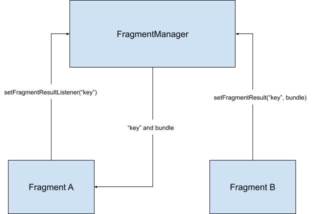

#Android Note

快捷键：command+> 收缩/展开代码块

## 四大组件(Activity、BroadcastReceiver、Content Provider、Service)

### Activity

#### Intent


### BroadcastReceiver

#### 发送

普通广播：Content.sendBroadcast(Intent myIntent)
有序广播：Content.sendOrderedBroadcast(Intent myIntent)
异步广播：Content.sendStickyBroadcast(Intent myIntent)
有序异步广播：Content.sendStickyOrderedBroadcast(intent, ...)

对异步广播，需要调用removStickyBroadcast才能主动去掉

#### 监听

注册/取消注册: registerReceiver()/unregisterReceiver()

### Content Provider

数据集，包括文件系统、数据库(sqlite)系统

### Service

系统提供的功能，如多媒体播放器

service的生命周期


## Activity

单独的屏幕，控件的承载体。两个activity是通过Intent(动作view/pick/edit/M AIN和数据URI)跳转

AndroidManifest.xml: 应用的启动入口，指定Activity，添加Intent-filter等。
Intent-filter：满足一定的条件之后，就会调起该activity
>注意：当别的应用想要吊起我们的应用，需要在指定的Activity使用android:promission，而别的应用需要在manifest中添加uses-promission标签

```xml
    <!-- Called App -->
    <manifest>
    <activity android:name="...."
       android:permission=”com.google.socialapp.permission.SHARE_POST”

    />

    <!-- 当系统发送MAIN指令的时候，会调起该 activity -->
    <intent-filter>
        <action android:name="android.intent.action.MAIN" />

        <category android:name="android.intent.category.LAUNCHER" />
    </intent-filter>

    <!-- 当系统发送SEND指令(发送邮件)的时候，会调起该 activity -->
    <intent-filter>
        <action android:name="android.intent.action.SEND" />
        <data android:type="*/*" />
        <category android:name="android.intent.category.DEFAULT" />
    </intent-filter>


    <!-- My Application -->
    <manifest>
       <uses-permission android:name="com.google.socialapp.permission.SHARE_POST" />
    </manifest>

```
### 生命周期

LifecycleObserver 可以监听到生命周期调用的方法

#### onCreate()
必须实现
需指定`contentView`
#### onStart()
在`onCreate()`之后，表明程序已启动
#### onResume()
在`onStart()`之后，表明activity已经在最上层，直接响应用户的操作
#### onPause()
Activity 失去焦点并进入“已暂停”状态
#### onStop()
Activity 对用户不再可见，可以用于保存数据
#### onRestart()
处于“已停止”状态的 Activity 即将重启
#### onDestroy()
系统会在销毁 Activity 之前调用此回调


### 界面间传值

从A->B界面传值
```
    // jump to next activity
    Intent intent = new Intent(getActivity(), DisplayMessageActivity.class);
    intent.putExtra("displayMessage", dict.toString());
    startActivity(intent);

    // get extra values
    getIntent().getStringExtra("displayMessage");
```

从B->A，返回A需要值
在B中使用startActivityForResult()为上层界面传值
```
     public boolean onKeyDown(int keyCode, KeyEvent event) {
         if (keyCode == KeyEvent.KEYCODE_DPAD_CENTER) {
             // When the user center presses, let them pick a contact.
             startActivityForResult(
                 new Intent(Intent.ACTION_PICK,
                 new Uri("content://contacts")),
                 PICK_CONTACT_REQUEST);
            return true;
         }
         return false;
     }
```
在A中使用onActivityResult获取

```
    protected void onActivityResult(int requestCode, int resultCode,
             Intent data) {
         if (requestCode == PICK_CONTACT_REQUEST) {
             if (resultCode == RESULT_OK) {
                 // A contact was picked.  Here we will just display it
                 // to the user.
                 startActivity(new Intent(Intent.ACTION_VIEW, data));
             }
         }
     }
```

### fragment

类似iOS中的view，由activity管理


#### 在运行时为Activity添加Fragment

FragmentManager: 
FragmentTransaction: 用来管理事务(add、remove、replace、commit等)

添加一个fragment，首先要获取一个管理器(getSupportFragmentManager()，回退栈管理)
布局的话需要使用四大布局

#####Fragment之间传递数据



#### 使用xml布局fragment
使用开发工具直接创建，会生成对应的xml。然后在xml直接拖控件，类似iOS的storyboard。

问题：
1、布局的种类？
使用xml，采用layout布局
2、如何修改布局？
使用事务管理replace
3、布局的实现原理?
4、界面之间的传值原理？

#### 布局

MotionLayout: 管理应用中的运动和微件动画，constraintlayout子类
linearlayout: 线性布局
constraintlayout: 相对布局

屏障约束：辅助线，帮助设置屏障线，保证其他的控件能以此线为基准(只能是屏幕上有的控件的四边)

##### 关键帧动画
ConstraintSet 
TransitionManager 


