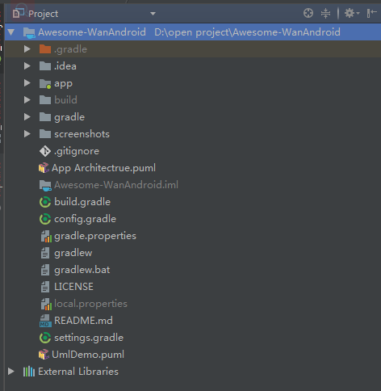
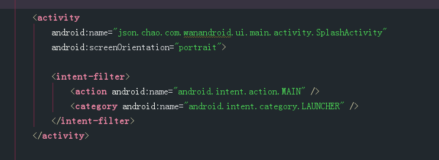
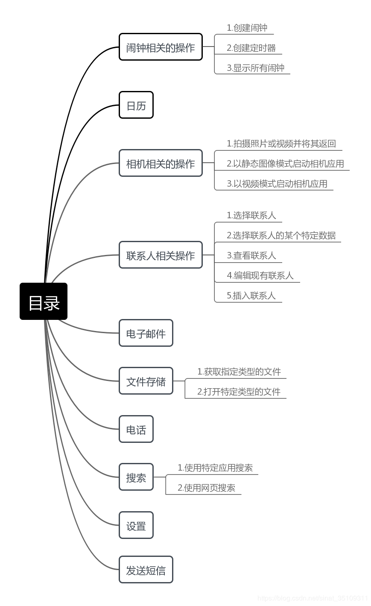
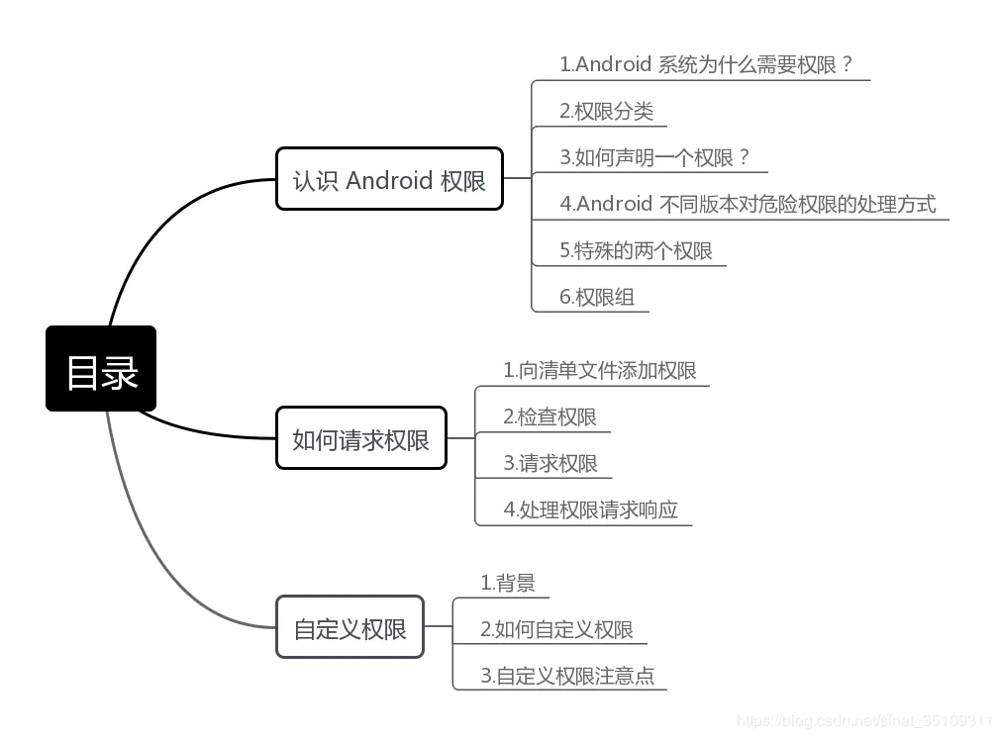
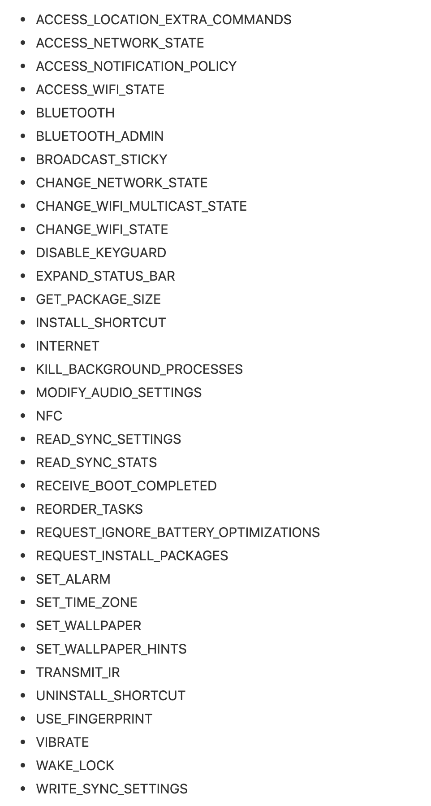
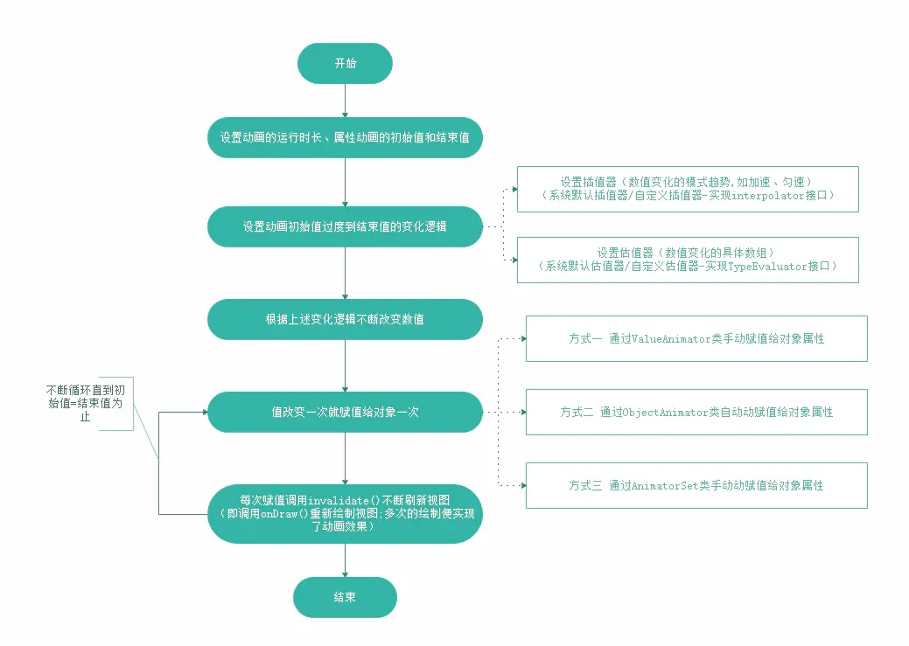
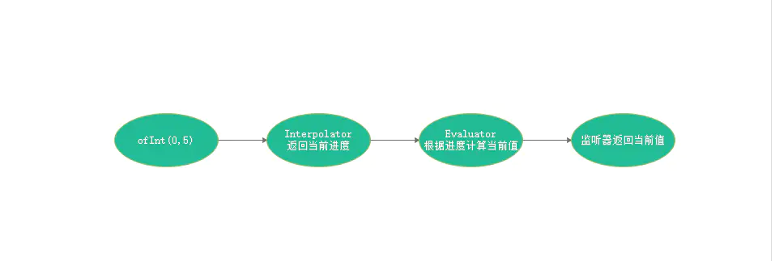
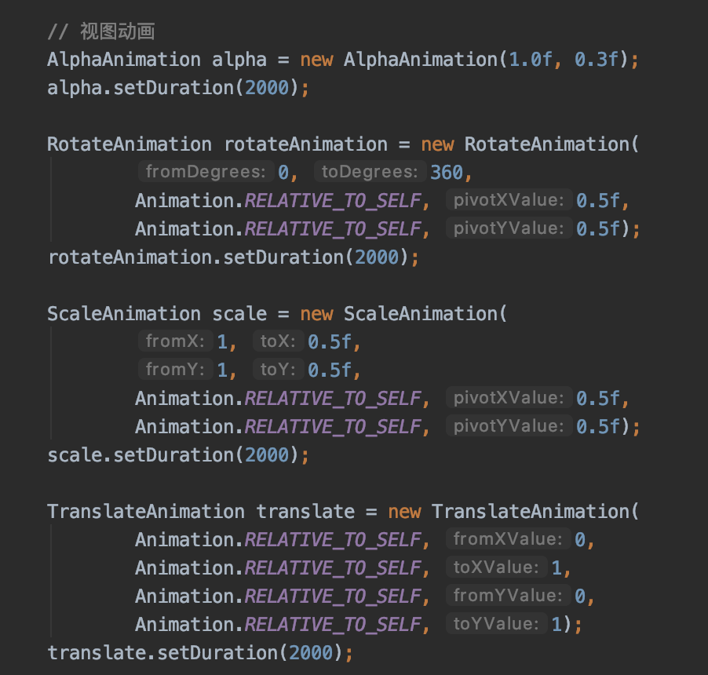

# Android NoteBook

## 简介

### Android 系统架构

四层：Linux内核层，系统运行库层，应用框架层，应用层

##### 系统运行库层(System)

这一层通过一些C/C++库来为Android系统提供了主要的特性支持。如SQLite库提供了数据库的支持，OpenGl|ES库提供了3D绘图的支持，Webkit库提供了浏览器内核的支持等。

同样这一层还有Android运行时库，它主要提供了一些核心库，能够允许开发者使用Java语言来编写Android应用。另外，Android运行库中还包含了Dalvik虚拟机（5.0系统之后改为ART运行环境），它使得每一个Android应用都能运行在独立的进程中，并且拥有一个自己的Dalvik虚拟机示例。相较于Java虚拟机，Dalvik是专门为移动设备定制的，它针对手机内存、CPU性能有限等情况做了优化处理

##### Linux内核层

Android系统是基于Linux内核的，这一层为Android设备的各种硬件提供了底层的驱动，如显示驱动、音频驱动、照相机驱动、蓝牙驱动、Wi-Fi驱动、电源管理等。

##### 应用框架层

这一层主要提供了构建应用程序时可能用到的各种API,Andorid自带的一些核心应用就是使用这些API完成的，开发者也可以通过使用这些API来构建自己的应用程序。

##### 应用层

所有安装在手机上的应用程序都是属于这一层的，比如系统自带的联系人、短信等程序，或者是你从Google Play上下载的小游戏，当然还包括你自己开发的程序。


### 了解Android 项目结构

#### 准备开发环境

1、直接安装Android Studio(Application name: 应用名称, Package name: 包名确保唯一)，按提示操作，直至finished。<br>
2、创建一个新的app(file -> new project)<br>
3、编译并运行您的程序<br>


#### 工程分析

项目的结构列表位于最左边，刚创建的新项目默认使用Android模式的项目结构，但这并不是真实的目录结构，是为了快速开发而设置的，点击结构列表上面的下拉列表，选择Proejct，即看到真实的目录结构<br>


1、__.gradle 和 .idea__ 文件夹，自动生成，不需要关注<br>
2、__app__ 项目的代码、资源目录，开发工作基本在此目录下进行<br>
3、__build__ 编译过程时产生的文件<br>
4、__gradle__ 目录下包含了gralde wrapper的配置文件，使用gradle wrapper的方式不需要提前将gradle下载好，而是会自动根据本地的缓存情况决定是否需要联网下载gradle。Android Studio默认不启动gradle wrapper的方式，可以点击AS导航栏->File->Settings->Build,Execution,Deployment->Gradle进行配置更改。<br>
5、__.gitignore__ 将指定的目录或文件排除在版本控制之外。<br>
6、__build.gradle__ 项目全局的gradle构建脚本。<br>
7、__gradle.properties__ 这个文件时全局的gradle配置文件，配置的属性会影响项目所有的gradle编译脚本。<br>
8、__gradle和gradlew.bat__ 用来在命令行界面中执行gradle命令，其中gradlew是在Linux或Mac系统中使用的，gradlew.bat是在Windows系统中使用的。<br>
9、__HelloWorld.iml__ iml文件是所有IntelliJ IDEA项目都会自动生成的一个文件(Android Studio基于IntelliJ IDEA),用于标识这是一个IntelliJ IDEA项目。<br>
10、l__ocal.properties__ 用于指定本机中的SDK和NDK路径，自动生成，如果SDK/NDK位置发生改变，改成新位置即可。<br>
11.__settings.gradle__ 用于指定项目中所有引入的模块。一般都是自动引入。<br>

##### app文件夹分析

1、__build__ 与外层的build目录类型，包含编译时自动生成的文件。<br>
2、__libs__ 用于存放第三方jar包，其会被自动添加到构建路径中去。<br>
3、__androidTest__ 用来编写Android Test测试用例的，可以对项目进行一些自动化测试。<br>
4、__java__ 放置Java代码的地方。<br>
5、__res__ 用于存放图片、布局、字符串等资源。比如说，图片放在drawable目录下，布局放在layout目录下，字符串放在values目录下。<br>
6、__AndroidManifest.xml__ 整个项目的配置文件，用于定义四大组件和添加静态权限声明。没有在AndroidManifest.xml里注册的活动是不能使用的<br>
7、__test__ 用来编写Unit Test测试用例。<br>
8、__.gitignore__ 和外层.gitignore文件类似。<br>
9、__app.iml__ 和外层app.iml文件类似。<br>
10、__build.gradle__ app模块的gradle构建脚本，其中会指定很多项目构建相关的配置。<br>
11、__proguard-rules.pro__ 用于指定代码的混淆规则，混淆会使破解者难以阅读反编译的代码。<br>



Android程序设计为逻辑和视图分离，因此使用setContentView()的方式将对应的布局引进来。

##### 项目中的资源

* drawable。所有以drawable开头的文件夹用来存放图片。
* mipmap。所有mipmap开头的文件夹用来存放应用图标。
* values。所有已values开头的文件夹用来存放字符串、样式、颜色等配置。
* layout。用来存放布局文件。

其中mipmap会有hdpi、xhdpi、xxhdpi等后缀，是为了适配屏幕的分辨率，从而更好地兼容各种设备，一般放在mipmap-xxhdpi下就可以了。

res/values/strings.xml文件下可以被程序<strong> “R.string.xxx”</strong>或<strong> “@ string/xxx”</strong>>引用


##### build.gradle文件（app项目下的）

Gradle基于Groovy的领域特定语言(DSL)来声明项目设置。

```
apply plugin: 'com.android.application'             // 应用程序模块，也可以是com.android.library
apply plugin: 'kotlin-android'                      // kotlin模块
apply plugin: 'kotlin-android-extensions'           // kotlin为Android提供的插件
apply plugin: 'kotlin-kapt'                         // kotlin通过kapt编译器支持注解
apply plugin: 'androidx.navigation.safeargs.kotlin' // Android 10 中kotlin相关的导航栏

android {
    compileSdkVersion rootProject.compileSdkVersion // 用于指定项目的编译版本
    dataBinding {// 数据绑定
        enabled = true
    }
    defaultConfig {
        applicationId "com.google.samples.apps.sunflower"// 应用ID
        minSdkVersion rootProject.minSdkVersion// 最低支持的版本
        targetSdkVersion rootProject.targetSdkVersion// 充分支持某一版本
        testInstrumentationRunner "androidx.test.runner.AndroidJUnitRunner"
        versionCode 1
        versionName "0.1.6"
        vectorDrawables.useSupportLibrary true
    }
    buildTypes {
        debug {// 指定生成测试版安装文件的配置
            // ...
        }
        release {// 指定生成正式版安装文件的配置
            minifyEnabled false // 是否对包进行混淆 
            proguardFiles getDefaultProguardFile('proguard-android.txt'), 'proguard-rules.pro'
        }
    }
    compileOptions {
        sourceCompatibility JavaVersion.VERSION_1_8
        targetCompatibility JavaVersion.VERSION_1_8
    }
    // work-runtime-ktx 2.1.0 and above now requires Java 8
    kotlinOptions {
        jvmTarget = "1.8"
    }
}

dependencies {// 依赖库
    // implementation fileTree(include: ['*.jar'], dir: 'libs') 本地依赖库申明, 表示将libs目录下的所有.jar后缀的文件都添加到项目的构建路径当中
    kapt "androidx.room:room-compiler:$rootProject.roomVersion"
    kapt "com.github.bumptech.glide:compiler:$rootProject.glideVersion"
    implementation "androidx.appcompat:appcompat:$rootProject.appCompatVersion"// 远程库依赖
    implementation "androidx.constraintlayout:constraintlayout:$rootProject.constraintLayoutVersion"
    implementation "androidx.core:core-ktx:$rootProject.ktxVersion"
    implementation "androidx.fragment:fragment-ktx:$rootProject.fragmentVersion"
    implementation "androidx.lifecycle:lifecycle-extensions:$rootProject.lifecycleVersion"
    implementation "androidx.lifecycle:lifecycle-livedata-ktx:$rootProject.lifecycleVersion"
    implementation "androidx.lifecycle:lifecycle-viewmodel-ktx:$rootProject.lifecycleVersion"
    implementation "androidx.navigation:navigation-fragment-ktx:$rootProject.navigationVersion"
    implementation "androidx.navigation:navigation-ui-ktx:$rootProject.navigationVersion"
    implementation "androidx.recyclerview:recyclerview:$rootProject.recyclerViewVersion"
    implementation "androidx.room:room-runtime:$rootProject.roomVersion"
    implementation "androidx.room:room-ktx:$rootProject.roomVersion"
    implementation "androidx.viewpager2:viewpager2:$rootProject.viewPagerVersion"
    implementation "androidx.work:work-runtime-ktx:$rootProject.workVersion"
    implementation "com.github.bumptech.glide:glide:$rootProject.glideVersion"
    implementation "com.google.android.material:material:$rootProject.materialVersion"
    implementation "com.google.code.gson:gson:$rootProject.gsonVersion"
    implementation "org.jetbrains.kotlin:kotlin-stdlib-jdk8:$rootProject.kotlinVersion"
    implementation "org.jetbrains.kotlinx:kotlinx-coroutines-android:$rootProject.coroutinesVersion"
    implementation "org.jetbrains.kotlinx:kotlinx-coroutines-core:$rootProject.coroutinesVersion"

    //新建项目默认没有这个依赖，要使用它，需要创建一个和app模块的同级模块库,然后在使用格式
    // compile project(':helper')，即为依赖了创建的helper库
    // Testing dependencies
    androidTestImplementation "androidx.arch.core:core-testing:$rootProject.coreTestingVersion"
    androidTestImplementation "androidx.test.espresso:espresso-contrib:$rootProject.espressoVersion"
    androidTestImplementation "androidx.test.espresso:espresso-core:$rootProject.espressoVersion"
    androidTestImplementation "androidx.test.espresso:espresso-intents:$rootProject.espressoVersion"
    androidTestImplementation "androidx.test.ext:junit:$rootProject.testExtJunit"
    androidTestImplementation "androidx.test.uiautomator:uiautomator:$rootProject.uiAutomatorVersion"
    androidTestImplementation "androidx.work:work-testing:$rootProject.workVersion"
    androidTestImplementation "com.google.truth:truth:$rootProject.truthVersion"
    testImplementation "junit:junit:$rootProject.junitVersion"
}
```

[参考文档](https://github.com/JsonChao/Awesome-Android-Notebook/blob/master/notes/%E7%AC%AC%E4%B8%80%E8%A1%8C%E4%BB%A3%E7%A0%81%EF%BC%88%E7%AC%AC%E4%BA%8C%E7%89%88%EF%BC%89.md#%E4%B8%80%E5%BC%80%E5%A7%8B%E5%90%AF%E7%A8%8B%E4%BD%A0%E7%9A%84%E7%AC%AC%E4%B8%80%E8%A1%8Candroid%E4%BB%A3%E7%A0%81)

### 数据持久化share

* 文件存储
* sqlite 存储
* SharedPreferences

#### 文件存储


#### 数据库存储

使用sqlite操作数据库

* 添加数据的方法如下：

```
db.execSQL("insert into Book (name, author, pages, price) values(?, ?, ?, ?)", new String[] {"The Da Vinci Code", "Dan Brown", "454", "16.96"});

db.execSQL("insert into Book (name, author, pages, price) values(?, ?, ?, ?)", new String[] {"The Lost Symbol", "Dan Brown", "510", "19.95"});
```

* 更新数据的方法如下：

```
db.execSQL("update Book set price = ? where name = ?", new String[] {"10.99", "The Da Vinci Code"});
```

* 删除数据的方法如下：

```
db.execSQL("delete from Book where pages > ?", new String[] {"500"});
```

* 查询数据的方法如下：

```
db.rawQuery("select * from Book", null);
```

#### SharedPreferences

>有三种方法用于得到SharedPreferences对象, SharePreferences文件都是存放在/data/data//shared_prefs/目录下的。
>
> * Context类中的getSharedPreferences()方法，可以任意指定其文件名。
> * Activity类中的getPreferences()方法，使用当前活动的类名作为文件名。
> * PreferenceManager类中的getDefaultSharedPreferences()方法，使用当前应用程序的包名作为前缀来命名文件名。

### 多媒体设备

#### 摄像头/相册


#### 通知

```
setSound()
setVibrate()
setLights()
setStyle()
setPriority()
```

###### 设置通知的重要程度
* PRIORITY_DEFAULT表示默认的重要程度，和不设置效果是一样的

* PRIORITY_MIN表示最低的重要程度，系统可能只会在特定的场景才会显示这条通知，比如用户下拉状态栏的时候

* PRIORITY_LOW表示较低的重要程度，系统可能会将这类通知缩小，或改变其显示的顺序，将其排在更重要的通知之后

* PRIORITY_HIGH表示较高的重要程度，系统可能会将这类通知放大，或改变其显示的顺序，将其排在比较靠前的位置

* PRIORITY_MAX表示最高的重要程度，这类通知消息必须要让用户立刻看到，甚至需要用户做出响应操作

```
setPriority(NotificationCompat.PRIORITY_MAX)
```

#### 


### 广播(Broadcast)

与iOS的通知类似，广泛运用的、在应用程序之间传输信息的机制。
Android 中的广播与传统意义上的电台广播类似，一个广播可以有任意个接收者，当然也可能不被任何应用程序所接收。广播机制是一个典型的发布-订阅模式，也就是观察者模式

广播三要素：发送者(广播的定义者)、接收者、发送内容。

广播分类：普通广播、有序广播、本地广播、sticky广播

#### 普通广播

```
sendBroadcast(intent);// 异步广播
```

#### 有序广播

```
Context.sendOrderedBroadcast()// 发送带权广播，同步广播
```

#### 本地广播

仅限本应用信息广播

之前广播都是全局的，所有应用程序都可以接收到，这样就会带来安全隐患。但是，有的时候我们并不需要把自己的应用内的信息广播给所有应用，而只是进程内使用，现在使用 Support v4 包中的 LocalBroadcastManager 就能够实现限于应用内的广播。
它的用法很简单，只需要把调用 context 的 sendBroadcast、registerReceiver、unregisterReceiver 的地方替换为 LocalBroadcastManager.getInstance(Context context) 中对应的函数即可：

#### sticky广播

sticky 广播通过 Context.sendStickyBroadcast() 函数来发送，用此函数发送的广播会一直滞留，当有匹配此广播的广播接收器被注册后，该广播接收器就会收到此条广播。使用此函数发送广播时，需要获得 BROADCAST_STICKY 权限：

```
<uses-permission android:name="android.permission.BROADCAST_STICKY"/>
```

复制代码sendStickyBroadcast() 只保留最后一条广播，并且一直保留下去，这样即使已经有广播接收器处理了该广播，当再有匹配的广播接收器被注册时，此广播仍会被接收。如果你只想处理一遍该广播，可以通过 removeStickyBroadcast() 函数实现


### ContentProvider(外共享数据)

跨进程传递数据

[ContentProvider 参考](https://juejin.im/post/5dad25405188252e6f6ef398)


### Intent 和 Intent 过滤器

Intent 是一个消息传递对象，用来向其他组件请求操作，无论该组件是当前应用还是其他应用。具体来说包含三大用处： 启动一个 Activity、启动或者绑定 Service、传递广播。

如果想访问其他组件或者启动其他组件可以使用 Intent 来操作。在四种组件类型中，有三种（Activity、Service 和 Broadcast）均可以通过异步消息 Intent 进行启动。Intent 会在运行时对各个组件进行互相绑定。所以我们可以把 Intent  当作是各个组件之间的信使（无论该组件是自己 App 的还是其他 App）。
每个组件都有不同的启动方法：

如要启动 Activity，可以用 startActivity() 或 startActivityForResult() 传递 Intent（需要 Activity 返回结果时）

如要启动 Service，可以通过 startService()传递 Intent 来启动服务，也可通过 bindService() 传递 Intent 来绑定到该服务

如要发送 Broadcast，可以通过 sendBroadcast()、sendOrderedBroadcast() 或 sendStickyBroadcast() 等方法传递 Intent 来发起广播

与 Activity、Service 和 Broadcast，ContentProvider 并非由 Intent 启动。相反，它们会在成为 ContentResolver 的请求目标时启动。想要访问 ContentProvider 的内容，可以通过 ContentResolver 调用 query()、insert()、update()、delete()等方法。


> 一个 Intent 对象会携带一些信息，Android 系统会根据这些信息来确定要启动哪个组件。具体来说会携带以下七种信息：
ComponentName、Action、Category、Data 、Type、Extra、Flags。我们可以把这七种信息称之为 Intent 的七大属性

* _ComponentName_ 表明要显示的启动具体的控件
* _Action_  跳转的动作，我们可以自定义，也可使用系统的，比如：Intent.ACTION_SEARCH
* _Category_ Category 属性为 Action 增加额外的附加类别信息，配合action使用
* _Data_ 属性通常是为 Action 属性提供要操作的数据，Data属性的值是一个Uri对象 _schema://host:port/path_
* _Type_ 属性用于指定 Data 所制定的 Uri 对应的MIME 类型
* _Extra_  属性用于添加一些附加信息，它的属性值是一个 Bundle 对象，通过键值对的形式存储数据。在隐式 Intent 中使用较少，主要用于显示 Intent 传递数据
* _Flags_

#### 常用的隐式Intent



参考文件：[Android 基础知识6：常用的隐式 Intent](https://juejin.im/post/5dbc0088f265da4d4b5fe5d0)

#### 权限管理



##### 普通权限

也是无感授权，用户无法修改/知晓该权限。
比如网络权限(ACCESS_WIFI_STATE/CHANGE_NETWORK_STATE)，蓝牙权限等。。。。



### 动画及过渡

##### 属性动画和视频动画的区别

视图动画系统仅提供为 View 对象添加动画效果的功能，因此，如果您想为非 对象添加动画效果，则必须实现自己的代码才能做到。视图动画系统也存在一些限制，因为它仅公开 对象的部分方面来供您添加动画效果；例如，您可以对视图的缩放和旋转添加动画效果，但无法对背景颜色这样做。

视图动画系统的另一个缺点是它只会在绘制视图的位置进行修改，而不会修改实际的视图本身。例如，如果您为某个按钮添加了动画效果，使其可以在屏幕上移动，该按钮会正确绘制，但 __能够点击按钮的实际位置并不会更改__，因此您必须通过实现自己的逻辑来处理此事件。

有了属性动画系统，您就可以完全摆脱这些束缚，还可以为任何对象（视图和非视图）的任何属性添加动画效果，并且实际修改的是对象本身。属性动画系统在执行动画方面也更为强健。概括地讲，您可以为要添加动画效果的属性（例如颜色、位置或大小）分配 Animator，还可以定义动画的各个方面，例如多个 Animator 的插值和同步。

不过，视图动画系统的设置需要的时间较短，需要编写的代码也较少。如果视图动画可以完成您需要执行的所有操作，或者现有代码已按照您需要的方式运行，则无需使用属性动画系统。在某些用例中，也可以针对不同的情况同时使用这两种动画系统。

##### 属性动画(android.animation)

只关心数值变化，不关心动画本身的效果。在处理数值之后会传给view去处理，并做相应的改变。
设置数值(初始、过渡、结束) -> 配置插值器(interpolator)、估值器(TypeEvaluator) -> 设置动画对象，并使用animator(ValueAnimator、ObjectAnimator、AnimatorSet)对象设置view的属性。如图：



ValueAnimator: 提供动画值的改变，不绑定view



ObjectAnimator: 自动绑定对象

常用属性: rotationX,rotationY,rotation,scaleX,scaleY,translationX,translationY,alpha,width,height

另外还可以使用 __path__

AnimatorSet: 属性动画对象

__Interpolator:__ 时间插值器指定了如何根据时间计算动画中的特定值。可以简单理解为动画时速度的问题
__TypeEvaluator:__ 评估程序负责告知属性动画系统如何计算指定属性的值。(IntEvaluator,FloatEvaluator,ArgbEvaluator,TypeEvaluator)

##### 视图动画(android.view.animation)

也称为补间动画(Tween Animation)，只改变view的值



用于更新界面的 Animator 会使动画运行的每一帧都进行额外的渲染。因此，使用资源密集型动画可能会对应用的性能产生负面影响。

为界面添加动画效果所需的工作已添加到渲染管道的[动画阶段](https://developer.android.com/topic/performance/rendering/profile-gpu#at)。您可以启用 GPU 渲染模式分析并监控动画阶段，以了解您的动画是否会影响应用的性能。如需了解详情，请参阅 [GPU 渲染模式分析演示](https://developer.android.com/topic/performance/rendering/inspect-gpu-rendering#profile_rendering)。


##### AnimationDrawable、AnimatedVectorDrawable(可绘制图形形成动画效果)

AnimatedVectorDrawable: 矢量可绘制动画效果。一种无需像素化或进行模糊处理即可缩放的可绘制对象
AnimationDrawable: 静态可绘制动画效果，需要有绘制资源。接连加载一系列可绘制资源以创建动画

使用过渡添加动效


### Layout

#### RelativeLayout

该布局是相对于控件的布局，以下是相关属性的概况


### 绑定(ViewBinding, DataBinding)

#### 视图绑定(ViewBinding)


#### 数据绑定(DataBinding)

##### 单向绑定


##### 双向绑定

DataBindingUtil.setContentView

##### 事件绑定


### LiveData 和 ViewModel

#### LiveData

LiveData 是一个可以感知 Activity 、Fragment生命周期的数据容器。当 LiveData 所持有的数据改变时，它会通知相应的界面代码进行更新。同时，LiveData 持有界面代码 Lifecycle 的引用，这意味着它会在界面代码（LifecycleOwner）的生命周期处于 started 或 resumed 时作出相应更新，而在 LifecycleOwner 被销毁时停止更新。

LiveData 是一种可观察的数据存储器类。与常规的可观察类不同，LiveData 具有生命周期感知能力，意指它遵循其他应用组件（如 Activity、Fragment 或 Service）的生命周期。这种感知能力可确保 LiveData 仅更新处于活跃生命周期状态的应用组件观察者

##### 使用LiveData

创建步骤：

    1、创建livedata对象，通常是在viewmodel中创建；
    2、在fragment、activity等中创建observer用于监听其onChange
    3、关联livedata和fragment（或activity）


#### ViewModel

ViewModel 将视图的数据和逻辑从具有生命周期特性的实体（如 Activity 和 Fragment）中剥离开来。直到关联的 Activity 或 Fragment 完全销毁时，ViewModel 才会随之消失，也就是说，即使在旋转屏幕导致 Fragment 被重新创建等事件中，视图数据依旧会被保留。ViewModels 不仅消除了常见的生命周期问题，而且可以帮助构建更为模块化、更方便测试的用户界面。


### 其他

#### Java Handle

一般用于主线程开启子线程异步处理耗时操作，子线程做完后通过回调


