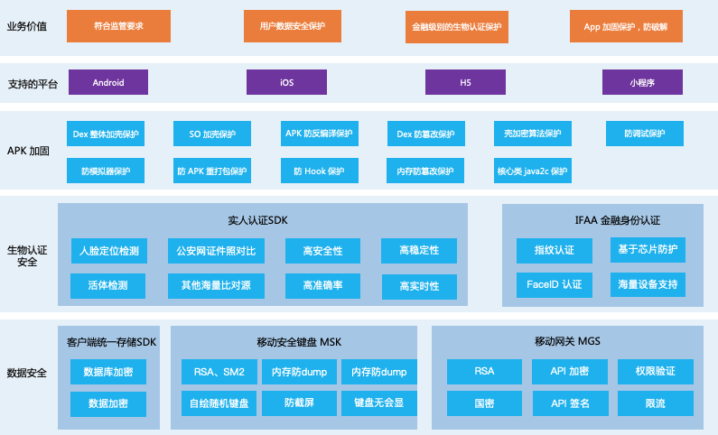
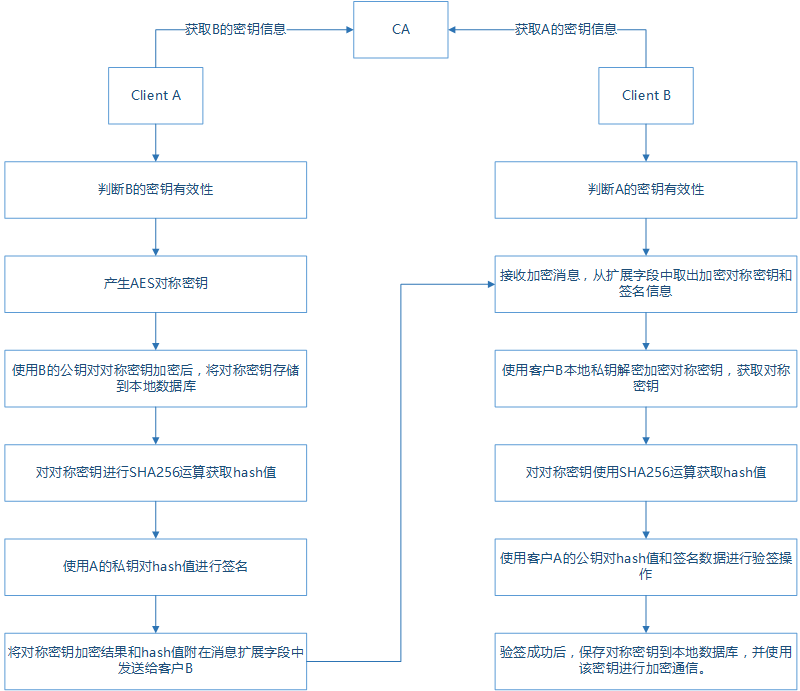
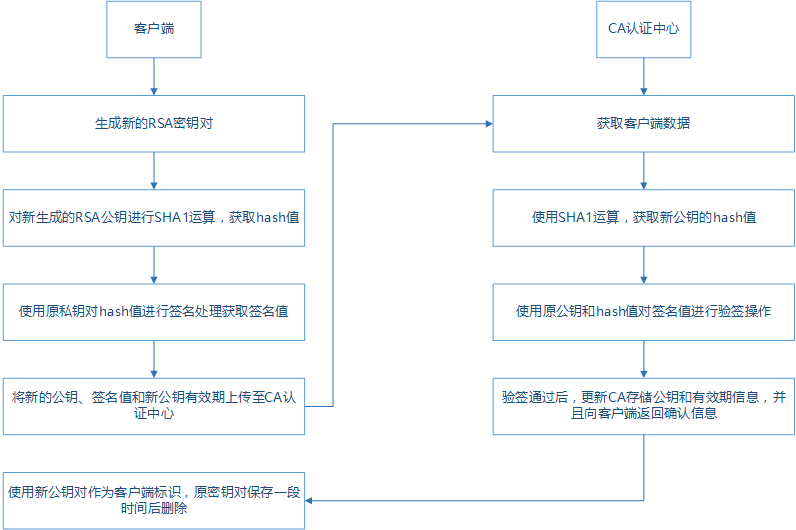
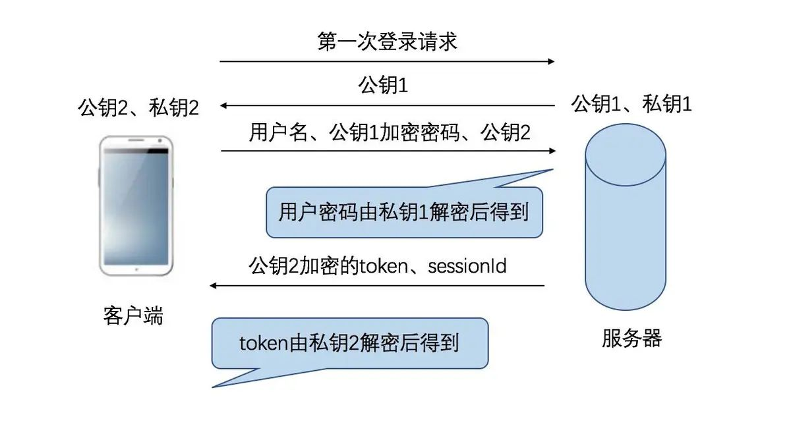
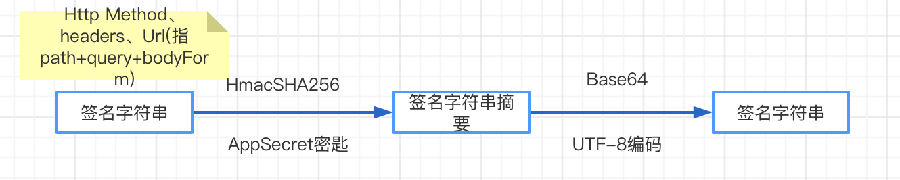
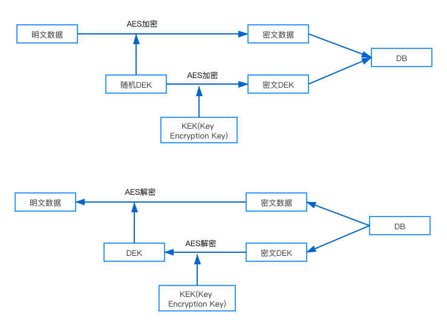

# App数据安全简述

## 概述

在互联网和新兴技术高速发展的今天，数据信息充斥在各行各业中，并发挥着重要的作用。有利就有弊，我们的数据(信息、产出内容等)也会在不经意间在网络上传播，无论是toB、toC、toG的各个业务场景来看，数据安全(Data Security)在新兴技术日新月异的数据时代变得越来越重要。

案例1：Facebook用户信息泄密，导致几百亿美元市值瞬间蒸发 
案例2：菲律宾金融服务公司数据泄露，大约有90万名客户数据在未经授权的情况下遭到黑客窃取 
案例3：Voipo数据泄露：价值数十亿美元的客户资料被曝光 
案例4：全部数据被清除，美国电邮商 VFEmail宣布倒闭 
案例5：Verifications.io数据库泄露8亿条记录 
案例6：美国外卖服务DoorDash数据泄露，影响490万人 
案例7：研究人员发现中国企业简历信息泄露：涉5.9亿份简历。主要是因为MongoDB和ElasticSearch服务器安全措施不到位 
案例8：美国医疗收集机构（AMCA）因数据泄露申请破产保护 
案例9: 警方铲除百亿“套路贷”！两大“套路”模式指向大数据泄露 
...

以上的案例不得不让我们重视数据安全，轻则损失名誉，重则倒闭。数据安全是企业走的更远更高层次的基础。

[2019年全球数据安全事件](https://www.anquanke.com/post/id/196567)

## App端数据攻击面

在App端，尤其是IoT应用，一些敏感信息和用户产生的数据或多或少都有可能存在泄漏的危险，自身的代码设计，相关人员的安全意识缺失，网络挟持/抓包/木马等等。。。防不胜防。
IoT应用中，主要攻击对象是：云平台、设备、软件。

### 云平台（网络请求/平台本身数据安全）

跨站脚本攻击(Cross Site Scripting, XSS)发生在客户端，可被用于进行窃取隐私、钓鱼欺骗、偷取密码、传播恶意代码等攻击行为。恶意的攻击者将对客户端有危害的代码放到服务器上作为一个网页内容， 使得其他网站用户在观看此网页时，这些代码注入到了用户的浏览器中执行，使用户受到攻击。一般而言，利用跨站脚本攻击，攻击者可窃会话 Cookie 从而窃取网站用户的隐私。
Get Shell、欺骗、篡改、信息泄漏、拒绝服务、特权提升、拖走数据库等各种手段获取大量数据

钓鱼欺骗、网站挂马、身份盗用、劫持用户 Web 行为、XSS 蠕虫...

### 设备

在设备层面需要保证本身权限(身份鉴权)的机制完善，且有严谨的防破坏机制。

* 固件代码安全：防止shell被窃取，从而导致设备失控
* 固件可信源验证：设备的root权限
* 芯片漏洞
* 通信接口(有线/无线)
* 防止文件copy
* 提供沙盒机制：防止软件间的恶性访问
* 存储设备加密/鉴权访问：密码，生物识别(指纹/面部)

### 软件（App）

1、get root权限(ios越狱)，反编译应用
2、网络请求敏感信息泄漏
3、文件被窃取(本地文件/数据库)

## 常用的加密算法
1、DES（Data Encryption Standard）：对称算法，数据加密标准，速度较快，适用于加密大量数据的场合； 
2、3DES（Triple DES）：是基于DES的对称算法，对一块数据用三个不同的密钥进行三次加密，强度更高； 
3、RC2和RC4：对称算法，用变长密钥对大量数据进行加密，比 DES 快； 
4、IDEA（International Data Encryption Algorithm）国际数据加密算法，使用 128 位密钥提供非常强的安全性； 
5、RSA：由 RSA 公司发明，是一个支持变长密钥的公共密钥算法，需要加密的文件块的长度也是可变的，非对称算法； 
6、DSA（Digital Signature Algorithm）：数字签名算法，是一种标准的 DSS（数字签名标准），严格来说不算加密算法； 
7、AES（Advanced Encryption Standard）：高级加密标准，对称算法，是下一代的加密算法标准，速度快，安全级别高，在21世纪AES 标准的一个实现是 Rijndael 算法； 
8、BLOWFISH，它使用变长的密钥，长度可达448位，运行速度很快； 
9、MD5：严格来说不算加密算法，只能说是摘要算法； 
10、PKCS:The Public-Key Cryptography Standards(PKCS)是由美国RSA数据安全公司及其合作伙伴制定的一组公钥密码学标准，其中包括证书申请、证书更新、证书作废表发布、扩展证书内容以及数字签名、数字信封的格式等方面的一系列相关协议。 
11、SSF33，SSF28，SCB2(SM1)：国家密码局的隐蔽不公开的商用算法，在国内民用和商用的，除这些都不容许使用外，其他的都可以使用； 
12、ECC（Elliptic Curves Cryptography）：椭圆曲线密码编码学。 
13、TEA(Tiny Encryption Algorithm)简单高效的加密算法，加密解密速度快，实现简单。但安全性不如DES，QQ一直用tea加密 

### 对称加密

| 名称 | 密匙长度 | 运算速度 | 安全性 | 资源消耗 |
| ------ | ------ | ------ | ------ | ------ |
|  DES |  56位 | 较快  | 低  |  中 |
|  3DES |  112位或168位 | 慢  | 中  |  高 |
| AES | 128、192、256位 | 快 | 高 | 低 |

### 非对称加密

| 名称 | 成熟度 | 运算速度 | 安全性(取决于密钥长度) | 资源消耗 |
| ------ | ------ | ------ | ------ | ------ |
|  RSA |  高 | 慢  | 高  |  高 |
|  DSA |  高 | 慢  | 高  |  只能用于数字签名 |
| ECC | 低 | 快 | 高 | 低(计算量小,存储空间占用小,带宽要求低) |

### 哈希(hash)摘要加密

| 名称 | 安全性 | 速度 |
| ------ | ------ | ------ |
| SHA-1 | 高 | 慢 |
| MD5 | 中 | 快

### 其他加密

量子技术:

混沌机制:

#### 算法选择(从性能和安全性综合)

对称加密: AES(256位),

非对称加密: ECC(160位)或RSA(1024),

消息摘要: MD5

数字签名:DSA

轻量级：TEA、RC系列（RC4），Blowfish （不常换密钥）

| 名称 | 数据大小(MB) | 时间(s) | 平均速度MB/S | 评价
| ------ | ------ | ------ | ------ | ------ |
| DES | 256 | 10.5 | 22.5 | 低 |
| 3DES | 256 | 12 | 12 | 低 |
| AES(256-bit) | 256 | 5 | 51.2 | 中 |
| Blowfish | 256 | 3.7 | 64 | 高 |

#### 多重加密

## App端数据安全防护

从攻击面来看，app数据安全可以从代码保护、数据存储安全(Android/iOS需要注意组件间数据传输安全)、网络安全方面处理。

### 代码

代码混淆、包/app加固、日志清理

### 网络及设备

##### 网络安全

* 使用SSL
* 添加网络安全配置
* 创建自己的信任管理器(KMS)
* 谨慎使用WebView(针对移动端)

关于登录验证(使用RSA256)：

支付安全相关案例:

详见PPT

##### 设备

* 安全环境监测/风险控制/设备指纹
* 防调试的方法
* 防逆向的方法
* 脱敏、数据加密(数据库、文件、敏感信息等)

海康网络方案:

#### App内本地数据加密

##### 数据库加密

方案1: 数据库本身就需要密码（动态密码）
方案2: 数据库中敏感数据加密存储（动态密匙）
方案3: 数据库加密及字段加密（静态密码，使用KMS管理DEK）

方案1案例: 微信

经了解微信使用的是设置数据库密码，密码的获取方式：imei + uin账号唯一标示 => MD5 取前7位作为数据库密码

方案2案例: QQ

每个会话都是根据sessionID取MD5，然后创建聊天会话的表，根据手机IMEI循环逐位异或来加密聊天的内容（每个会话都是一张表）

方案3案例: KMS/DEK(Data Encryption Key)

KMS(key management system)主要是不让业务系统单独对数据加解密。
KEK(Key Encryption Key)存储在KMS(Key Management System)中，防止app代码和数据库时也无法解密。

针对KEK和DEK：
DEK不能明文存储，加密后建议与密文一起存储
KEK每个应用或者每个用户应该使用不同的KEK，存储在KMS中，不能与DEK一起存储，在安全要求高的情况下，使用多级KEK
较安全的做法是，把加密后的DEK发送至KMS，得到未加密的DEK，然后再去解析密文。

##### 文件加密方案探讨

* 文件分块（切片），每个切片使用随机的DEK加密
* 每个DEK均使用业务KEK加密，加密后随对应的切片一起保存

如图

## 对app端数据安全的一些想法

* 用户自己的数据，可以采用用户口令、指纹等方式直接或间接保护，因为这种情况下key其实是随用户走的，可以做到key和算法、数据的分离
* 可以根据硬件条件进行加密，将密钥、算法都放在硬件中，比如USBKey中，安全性应该是有本质上的提升
* 其它情况推荐数据放在APP的服务端，将客户端做瘦，将安全的防护重点放在通信和服务端的防护上
* 存在本地的数据尽量不能被搜索，更不能直接匹配，建议分块搜索，或者使用搜索key（缩小搜索的范围）

## 结束

