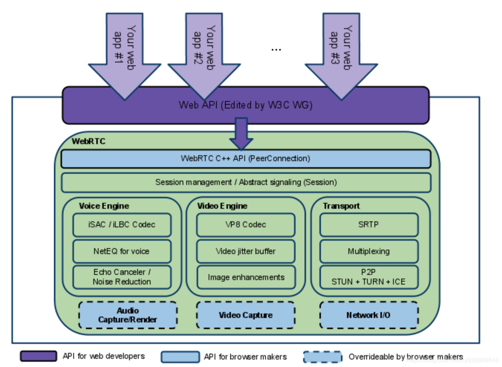

# WebRTC简介

## 概述

WebRTC(Web Real-Time Communications)是一项时事通讯技术，它允许网络应用或者站点，在不借助中间媒介的情况下，建立端之间点对点(Peer-to-Peer)的连接，实现视频流和音频流或者其他任意数据的传输。WebRTC包含的这些标准使用者在无需安装任何插件或第三方软件的情况下，创建点对点(Peer-to-Peer)的数据分享和电话会议成为可能。

### 使用场景

### 架构

## 名词说明

### PeerConnection

WebRTC P2P媒体通信解决方案的核心。实现会话，首要的是创建一个peerconnection，代表着一个由本地计算机到远端的webrtc连接。

### ICE

ICE 是一个 NAT 穿透框架，可以整合 STUN、TURN等 NAT 穿透协议，然后在 SDP 中增加传输记录值（ip + 端口 + 协议），然后进行连通性测试，要连通了就可以进行传输媒体数据了

### STUN

STUN 是 NAT 穿透的一套工具，它提供获取内网连接到公网连接的映射关系的机制，如NAT 示例，可以通过 STUN 服务器获得客户端的地址。

一个免费可用的 STUN 服务：stun:stun.l.google.com:19302。

### NAT

Network Address Translation: 网络地址转换。因为 ip 数据包通过路由器或防火墙会重写来源 IP 地址或目的 IP 地址，比如家用路由器使用网络地址端口转换（NAPT）, 它不仅改 ip，还修改 TCP 和 UDP 协议的端口号，这样就能让内网中的设备共用同一个外网 IP。举个例子，NAPT 维护一个类似下表的 NAT 表：

内网地址 | 外网地址 
----    |   ---
192.168.0.2:5566 | 120.132.92.21:9200 
192.168.0.2:7788 | 120.132.92.21:9201
192.168.0.3:8888 | 120.132.92.21:9202

NAT 设备会根据 NAT 表对出去和进来的数据做修改，比如将 192.168.0.3:8888 发出去的封包改成120.132.92.21:9202，外部就认为他们是在和 120.132.92.21:9202 通信，同时 NAT 设备会把收到的封包的IP和端口改成对应内网地址再发给内网的主机，这样内部和外部就能双向通信了。
所以 WebRTC 通过 ICE 来进行一个内网穿透来进行网络地址转换。

### TURN

TURN 协议是 STUN 协议的扩展，允许一个peer端使用一个中继地址(relay address)即可和多个peer端进行通信，通过为每个peer端分配中继地址，其他peer端向一个peer端的中继地址发送数据，TURN服务器即将数据转发给那个peer端。其实大部分时候都需要TURN服务器来中转，仅靠STUN打洞成功概率并不高。TURN服务器可以获得客户端的地址和中继地址。

### SDP

SDP（Session Description Protocol）会话描述协议。使用SDP协商会话的参数，比如媒体格式和网络传输地址。

WebRTC 通过 SDP 来进行会话参数协商，于是有了创建会话过程中的 Offer 和 Answer，Offer 和 Answer 都是 SDP。

### Offer/Answer

由于一次通话过程中可能会出现能力不对等的情况，比如使用了对端不支持的媒体格式，所以需要通过 Offer 和 Answer 来进行协商，若达成一致即开始会话，若未达成一致即报错，比如在 Android 端的 SdpObserver 中是由相关错误回调的，若在此步回调错误即需要看下是否两端采用了不兼容的配置。

## 基础

## 协议

## 流程

### 链接

### 会话生命周期

## WebRTC框架说明(web及iOS)

### 主要类

#### RTCPeerConnection

#### RTCSessionDescription

#### RTCIceCandidate

#### RTCPeerConnectionIceEvent

#### MessageEvent

## 使用中的坑

## 总结

## 参考

[WebRTC-Android 探索 - WebRTC 中名词解释](https://juejin.cn/post/6894901991929315335)