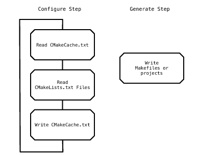
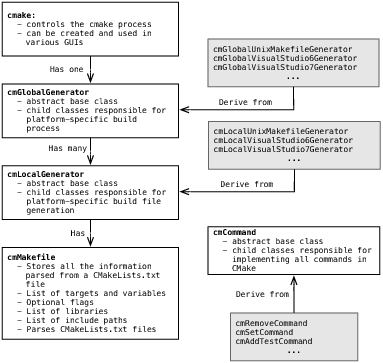

# CMake

## 介绍

cpp文件构建工具。有系列工具：cmake(软件构建工具)、ctest(测试工具)、cpack(打包工具)、cdash(web应用，用于持续集成测试)

#### 使命

1. 分离开发与构建目录
2. 高效解析依赖关系，变更文件后需重新构建该文件
3. 简单高效

## 流程/原理

两步：配置、生成



CMakeCache.txt：外部(External)、内部(Internal)输入变量(Cache Entries)

#### 生成流程



## CMakeLists.txt编写

### 步骤

#### 1.1 添加编译选项

```cmake
target_compile_features(main PRIVATE “-Wall”)
set_target_properties(main PROPERITES
    COMPILE_FLAGS "-Wall"
)
target_compile_features(mylib PUBLIC cxx_std_11)
```

#### 1.2 找到编译头文件

```cmake
命令: include_directories([AFTER|BEFORE] [SYSTEM] dir1 [dir2 ...])
示例: include_directories(${CMAKE_CURRENT_LIST_DIR}/include)
子文件: add_subdirectory()
```

#### 1.3 找到编译源文件

```cmake
aux_source_directory(./src ${hello_src})
```

#### 1.4 找到库文件

```cmake
link_directories(${CMAKE_CURRENT_LIST_DIR}/lib)
```

#### 1.5 链接库文件

```cmake
target_link_libraries(${PROJECT_NAME} util)
```

#### 1.6 生成target

```cmake
add_custom_command()
add_library(archive archive.cpp zip.cpp lzma.cpp)
add_executable(zipapp zipapp.cpp)
```


#### 其他指令

```js
# 控制台打印
message(STATUS “my custom debug info”)
# 操作文件
FILE()
# 循环控制
foreach()
endforeach()
# 定义宏
macro()
endmacro()
# 设置最低版本
CMAKE_MINIMUM_REQUIRED（VERSION 3.5）
# 工程名
PROJECT(output_binary_name CXX)
```


## 示例

```cmake
cmake_minimum_required (VERSION 3.2)
project (stexpression_engine C CXX)
enable_testing()

MESSAGE( STATUS "CMAKE_CXX_FLAGS: " ${CMAKE_CXX_FLAGS} )

# 支持c++11
set( CMAKE_CXX_FLAGS "-std=c++11" )

# Add some sanitary checks that the toolchain is actually working!
include(CheckCXXSymbolExists)
check_cxx_symbol_exists(kqueue sys/event.h HAVE_KQUEUE)
if(NOT HAVE_KQUEUE)
  message(STATUS "kqueue NOT found!")
else()
  message(STATUS "kqueue found!")
endif()

find_library(UIKIT_LIBRARY UIKit)
if (NOT UIKIT_LIBRARY)
  message(STATUS "UIKit.framework NOT found!")
else()
  message(STATUS "UIKit.framework found! ${UIKIT_LIBRARY}")
endif()

# Includes
include_directories(${example-ios_SOURCE_DIR}/include)

# Make sure try_compile() works
include(CheckTypeSize)
check_type_size(time_t SIZEOF_TIME_T)


# Source file
set(SOURCES
	EngineConfig.cpp
	function.cpp
	exprtk.hpp
	function.hpp
	STEngineManager.cpp
	json.hpp
)

# Headers
set(HEADERS
	./include/EngineConfig.hpp
	./include/SingletonBase.h
	./include/STEngineManager.hpp
)

# Library
add_library (${PROJECT_NAME} STATIC ${SOURCES} ${HEADERS})
message(STATUS "Building static version...")

if(CMAKE_INSTALL_PREFIX_INITIALIZED_TO_DEFAULT)
  set(CMAKE_INSTALL_PREFIX ${example-ios_SOURCE_DIR} CACHE PATH "Install path" FORCE)
MESSAGE( STATUS "example-ios_SOURCE_DIR lib: " ${example-ios_SOURCE_DIR} )
endif(CMAKE_INSTALL_PREFIX_INITIALIZED_TO_DEFAULT)

# Debug symbols set in XCode project
set_xcode_property(${PROJECT_NAME} GCC_GENERATE_DEBUGGING_SYMBOLS YES "All")

# Installation
install(TARGETS ${PROJECT_NAME}
        LIBRARY DESTINATION lib
        ARCHIVE DESTINATION lib/static)

install (FILES ${HEADERS} DESTINATION include)
```

