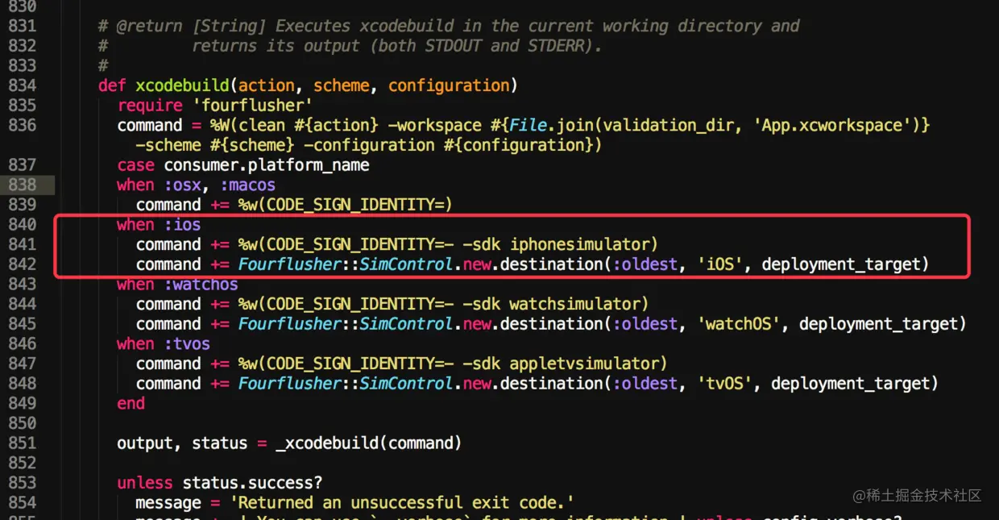
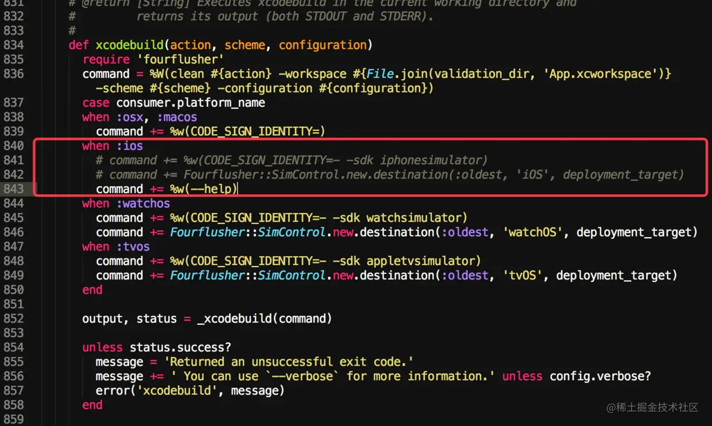

# CocoaPods

command：https://cocoapods.org/

## 一、基础用法

## 二、制作私有库

https://www.jianshu.com/p/5b52b49d2392

https://www.jianshu.com/p/46e305db873a

## 三、为xcode配置pod文件

### Xcode Build Setting Reference

https://pewpewthespells.com/blog/buildsettings.html#valid_archs

## 四、Questions

### pod lib lint undefined symbols for architecture x86_64

#### 解决方法1：

1. 在 podspec 文件中添加 `s.pod_target_xcconfig = { 'VALID_ARCHS[sdk=iphonesimulator*]' => '' }`，如果项目已经设置 `pod_target_xcconfig`，添加到已有值的后面。设置此处将在 模拟器编译时不产生二进制文件。
2. `pod lint` 命令添加 `--skip-import-validation` 参数，lint 将跳过验证 pod 是否可以导入。
3. `pod repo push` 命令添加 `--skip-import-validation` 参数，push 将跳过验证 pod 是否可以导入。

#### 解决方法2:

直接修改 `cocoapod` 的验证文件 `validator.rb`

##### 查找文件：

1. ##### 终端 `gem which cocoapods` 输出：`/usr/local/lib/ruby/gems/2.3.0/gems/cocoapods-1.3.0.beta.2/lib/cocoapods.rb`

2. ##### 终端 `open /usr/local/lib/ruby/gems/2.3.0/gems/cocoapods-1.3.0.beta.2/lib/` 将第一步命令输出的结果去掉最后的文件名`cocoapods.rb`，将前面的路径加到 `open`命令的后面, 执行命令后会在Finder打开一个**`lib`文件夹** 

3. #####  在当前`lib`目录下有个`cocoapods`文件夹，进入，`validator.rb`文件就在这个文件夹里

##### 修改文件:

	

[参考文章:解决pod lib lint repo push不支持i386编译&只能真机运行的库](https://juejin.cn/post/6844904046290026510)

