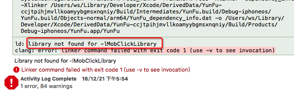
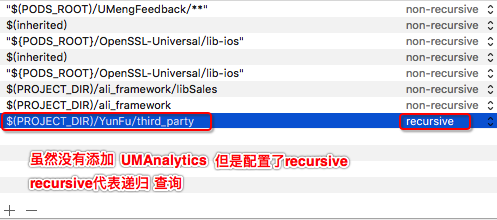

#### 问题描述

##### 表现形式：library not found for -lXXX
##### 例

#### 原因
 > 结论：无论我们以什么方式导入.framework静态库（cocoapods的方式或者直接把framework静态库拖拽到项目中的方式），如果没有配置framework的search路径，同样会报错，但报的错误却是和.a格式的静态库有些不同，如果我们项目中引入了framework格式静态库也使用了静态库（所谓使用就是import了framework静态库中的某个头文件），但没有配置search路径，那么就会报 xxx.h file not found 这类错误

####查找方法：

1、查看Library Search Paths配置是否正确<strong>$(PROJECT_DIR)</strong>；
2、检查是否把相应的文件加入到工程中
3、clear 缓存，重启xcode
4、如果是pod，则清除pod相关的所有文件
5、查看是不是没有对指定目录进行递归搜索(recursive，请查看“例图02”)

